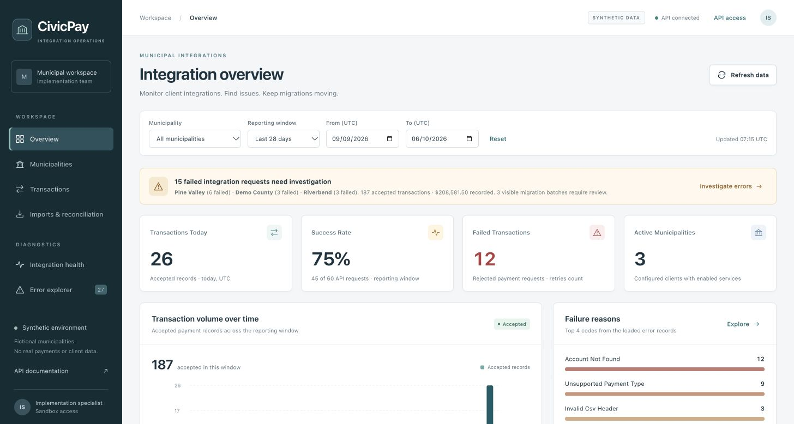
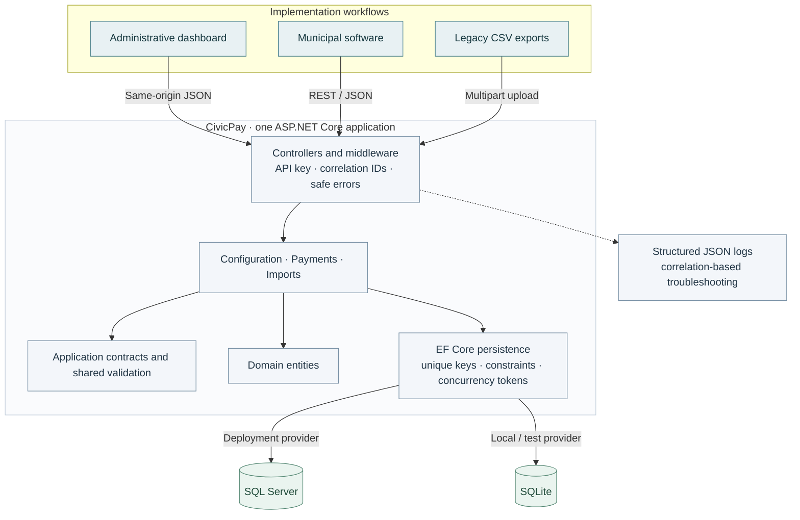
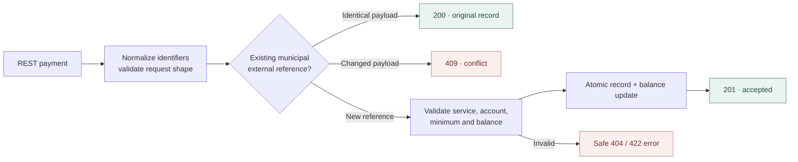
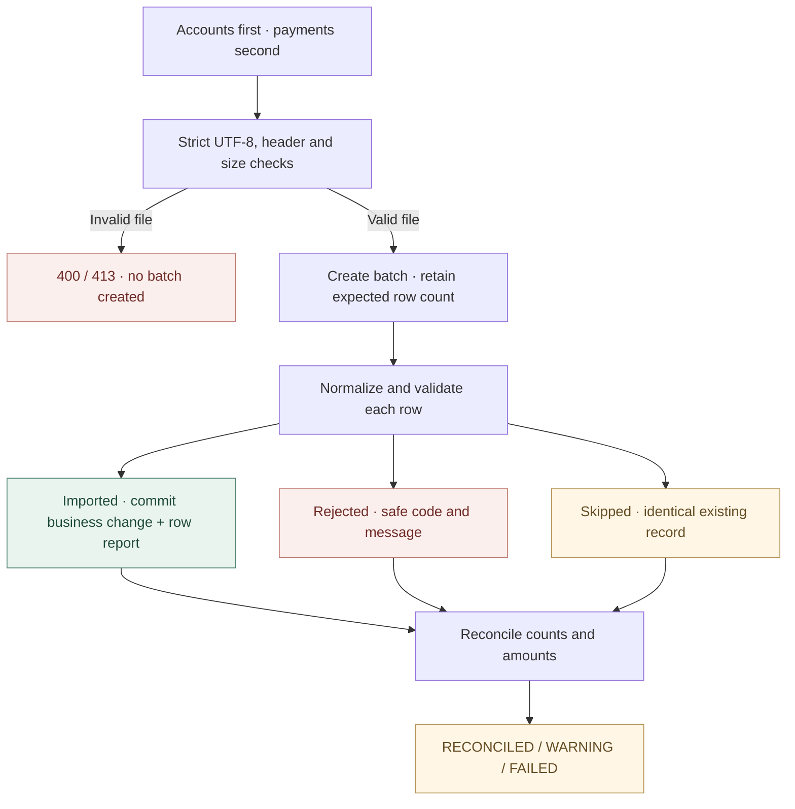
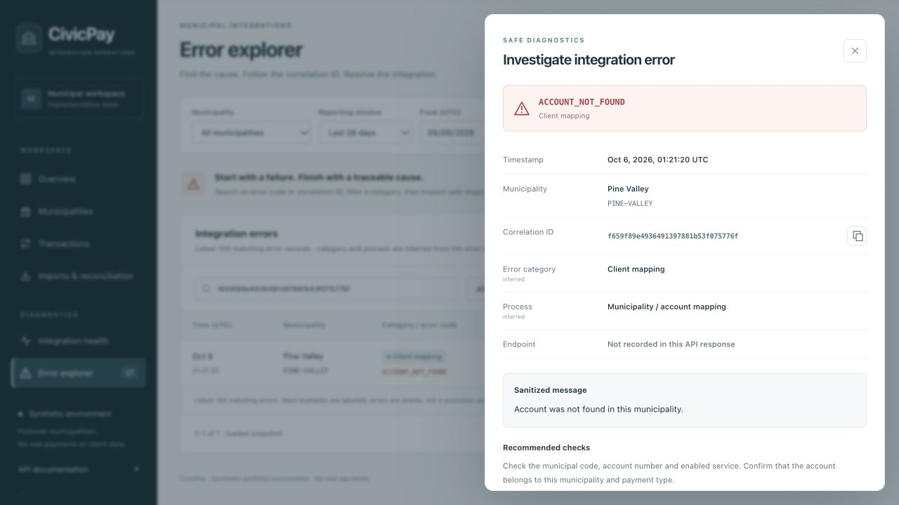
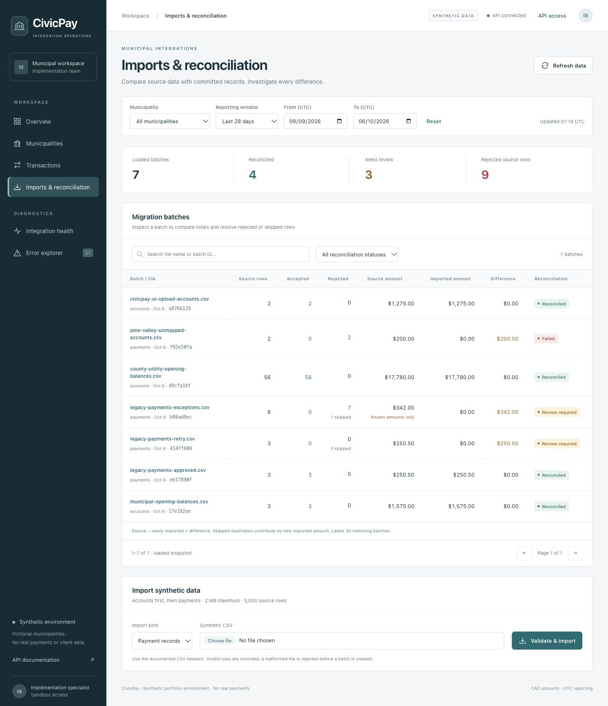

# CivicPay

**Municipal Payments Implementation & Integration Platform**

**C# | ASP.NET Core | SQL Server | REST APIs | JSON | Docker | xUnit**

A simulated multi-tenant municipal SaaS implementation platform demonstrating configurable business rules, REST integrations, CSV-to-SQL data migration, reconciliation, troubleshooting, and automated testing.

**All data and organizations are fictional. CivicPay does not process real payments.** This is a portfolio implementation exercise, with no banking, card processing or settlement integration.

[Run locally](#quick-start) · [API example](#try-the-api) · [Riverbend case study](#implementation-case-study) · [Documentation](#documentation-index)



Built for an implementation specialist answering: **Which client needs attention? Why did a request fail? Did the migration reconcile?** [Full overview screenshot](docs/screenshots/ui-overview.jpg).

## What the project demonstrates

| Implementation task              | Working capability                                                                                                                                   |
| -------------------------------- | ---------------------------------------------------------------------------------------------------------------------------------------------------- |
| Configure municipal clients      | CAD currency, enabled services, municipality-wide minimum and partial-payment rules; version-checked updates                                         |
| Integrate external software      | JSON REST endpoints, Swagger/OpenAPI, API-key access, structured errors and correlation IDs                                                          |
| Protect transaction delivery     | Identical reference retries replay the accepted record; changed payloads conflict; atomic balance updates and database uniqueness/concurrency checks |
| Migrate legacy records           | Account and payment CSV imports into a relational database, persisted imported/rejected/skipped row outcomes and paginated inspection                |
| Validate results                 | Source versus newly imported amounts, explicit differences, incomplete-total flags and RECONCILED / WARNING / FAILED statuses                        |
| Troubleshoot client integrations | Six dashboard views with client/date filters, KPIs, volume charts, error search, safe diagnostics and batch investigation                            |

Municipalities share one database. Records and references are scoped by municipality; authentication uses one shared API key, with no tenant-specific permissions or user roles. The supported catalogue is `PropertyTax`, `Utility`, `ParkingTicket`, `BusinessLicence` and `Permit`.

## Quick start

The quickest path uses **SQLite**, so no SQL Server or Docker installation is needed. Install a [.NET 10 SDK](https://dotnet.microsoft.com/en-us/download/dotnet/10.0) compatible with [global.json](global.json): 10.0.401 or a newer 10.0 feature band. Commands use Bash on macOS/Linux or a .NET-enabled Git Bash/WSL environment on Windows.

Clone the repository, then enter its `CivicPay` directory.

```bash
git clone https://github.com/tanmay-satija/CivicPay.git civicpay
cd civicpay/CivicPay
dotnet restore
bash scripts/run-demo.sh
```

The script builds/runs the API, creates an ignored local SQLite database, and seeds three fictional municipalities with 90 accounts, 168 accepted records and 12 labelled error examples on an empty database. It explicitly enables local Development demo access. No frontend installation is required.

- Dashboard: <http://127.0.0.1:5080>
- Swagger: <http://127.0.0.1:5080/swagger>
- Health: <http://127.0.0.1:5080/api/health>

Stop with Ctrl+C; data persists between runs. If port 5080 is occupied:

```bash
ASPNETCORE_URLS=http://127.0.0.1:5081 bash scripts/run-demo.sh
```

Use port 5081 in the browser and API examples for that run. A failed request in the dashboard can be an intentional validation test; error history is not an unresolved-incident queue.

### SQL Server with Docker

From the `CivicPay` directory, with Docker Engine/Compose and an x86-64-compatible SQL Server runtime:

```bash
cp .env.example .env
# Edit .env: replace BOTH placeholders with a SQL Server-compatible password
# and a random CIVICPAY_API_KEY of at least 24 characters.
# Avoid semicolons in SQL_PASSWORD because it is composed into a connection string.
docker compose up --build -d
```

Open the dashboard at <http://localhost:5080> and enter the key through **API access**; use Swagger's **Authorize** control for API calls. Compose applies the committed SQL Server migrations and seeds fictional records. Database data persists in a named volume; `docker compose down` stops containers while retaining it. Do not run both startup paths on port 5080 simultaneously.

SQL Server's container targets `linux/amd64`; Apple Silicon emulation is environment-dependent. An external SQL Server is another option in the [setup guide](docs/IMPLEMENTATION_GUIDE.md). Docker/SQL Server execution has not been verified here. The supplied Compose configuration uses loopback ports, `sa` and a trusted local certificate for demonstration; it is not a production security configuration. `.env` and local databases are ignored by Git and Docker build context.

## Try the API

With the local SQLite demo running, open a second Bash terminal in `CivicPay`. These examples first migrate an existing synthetic account, then submit a partial Property Tax payment against its CAD 1,000 opening balance:

```bash
API_URL=http://127.0.0.1:5080
curl -i "$API_URL/api/imports" \
  -F 'kind=accounts' -F 'file=@data/valid/accounts.csv'

curl -i "$API_URL/api/payments" \
  -H 'Content-Type: application/json' \
  -d '{"municipalityCode":"DEMO-COUNTY","accountNumber":"LEGACY-PT-1001","paymentType":"PropertyTax","amount":25.00,"transactionDate":"2026-01-01","externalReference":"README-PAY-001"}'
```

For secured Docker mode, add `-H "X-Api-Key: $CIVICPAY_API_KEY"` to each curl command after setting that environment variable in the host shell. A Compose `.env` file does not export variables to your shell.

Expected first payment response: **HTTP 201**:

```json
{
  "success": true,
  "transactionId": "<generated-guid>",
  "status": "Accepted",
  "replayed": false
}
```

Run the **same payment command** again: HTTP 200, the same transaction ID, `replayed=true`, and no second balance deduction. Reusing its reference with a different payload returns 409 `DUPLICATE_REFERENCE`. References are trimmed and case-sensitive; there is no separate `Idempotency-Key` header.

### Example validation failure

Demo County's minimum is CAD 5.00. This distinct reference submits CAD 1.00:

```bash
curl -i "$API_URL/api/payments" \
  -H 'Content-Type: application/json' \
  -d '{"municipalityCode":"DEMO-COUNTY","accountNumber":"LEGACY-PT-1001","paymentType":"PropertyTax","amount":1.00,"transactionDate":"2026-01-01","externalReference":"README-BELOW-MINIMUM-001"}'
```

Expected response: **HTTP 422**, with no balance deduction:

```json
{
  "success": false,
  "errorCode": "BELOW_MINIMUM",
  "message": "Amount is below the municipality minimum payment.",
  "correlationId": "<generated-correlation-id>"
}
```

Every API response includes `X-Correlation-ID`. Keep the reference and correlation ID for investigation. Unknown accounts return 404; unsupported services, overpayments and disallowed partial payments return 422. Dates must be between `2000-01-01` and today UTC. CAD is implicit in municipal configuration; the payment DTO has no currency field. [Complete API contract](docs/API_INTEGRATION_GUIDE.md).

## Architecture

One ASP.NET Core application hosts the dashboard and API. Four projects separate domain entities, application contracts/rules, EF Core services/persistence and HTTP hosting.



SQL Server and SQLite are alternative providers, not replicated databases. Monitoring also queries EF Core directly; request/error telemetry is persisted on a best-effort basis. Database constraints and business records, rather than telemetry alone, protect transaction correctness. [Architecture and tradeoffs](docs/ARCHITECTURE.md) · [Data model](docs/DATA_DICTIONARY.md).

### Integration workflow



Exact replay is checked before current balance/service rules, so a successful original remains retryable after balance or configuration changes. A unique municipal reference index and optimistic concurrency checks protect simultaneous requests. External client delivery queues, automatic outbound retries and webhooks are not implemented.

### Migration workflow



Account CSV supplies opening balances **before** migrated payments. Existing accounts are never overwritten. Each row commits independently; an interrupted file can retain earlier committed rows. Upload HTTP 201 does not mean every row was accepted. Limits: 2,000,000 file bytes and 5,000 data rows.

Reconciliation uses **source amount − newly imported amount = difference**. Skipped duplicates contribute no newly imported amount; missing/unparseable source amounts make the source total incomplete.

| Provided fixture, on a fresh seeded sandbox | Expected reconciliation                                               |
| ------------------------------------------- | --------------------------------------------------------------------- |
| `data/valid/accounts.csv`                   | 3 imported; CAD 1,575.00 source/imported; zero difference; RECONCILED |
| `data/valid/payments.csv`, after accounts   | 3 imported; CAD 250.50 source/imported; zero difference; RECONCILED   |
| Same payment file again                     | 3 skipped; CAD 0 newly imported; CAD 250.50 difference; WARNING       |

SQL schema/migration artifacts and reporting queries are in [sql/](sql/): [schema](sql/schema.sql), [transaction summary](sql/transaction_summary.sql), [municipal performance](sql/municipality_performance.sql), [failed requests](sql/failed_transactions.sql) and [reconciliation](sql/reconciliation.sql). CSV imports run through application validation and EF Core; there is no direct legacy database connector or automated ETL platform. [Migration guide](docs/DATA_MIGRATION_GUIDE.md).

## Screenshots

Actual browser captures from the running SQLite sandbox. Data is fictional; seeded error examples are labelled, and request metrics come from executed HTTP requests. Overview's success rate measures **API requests**, not unique transaction acceptance. Health/monitoring polling is excluded.

<details>
<summary>Error investigation and migration reconciliation</summary>





[Batch row diagnostics](docs/screenshots/ui-batch-investigation.jpg) · [Municipality configuration](docs/screenshots/ui-municipalities.jpg) · [Phone layout](docs/screenshots/ui-mobile.jpg)

</details>

To populate a **fresh local seeded sandbox** with the screenshot workflows, before importing any batches:

```bash
python3 scripts/populate-ui-demo.py
```

This optional workflow requires Python 3, submits synthetic imports/payments through the APIs, and deliberately exercises failed requests. It refuses a sandbox with existing batches. Use a new database path at startup if your default demo already has data:

```bash
ConnectionStrings__CivicPay='Data Source=/tmp/civicpay-portfolio-demo.db;Foreign Keys=True' \
  bash scripts/run-demo.sh
```

Use an unused path; stop the current server before starting another on the same port. If changing ports, set `CIVICPAY_URL` for the Python script. [Executed browser checks and reporting definitions](docs/UI_UX_VERIFICATION.md).

## Technology stack

| Area        | Implementation                                                                                                                       |
| ----------- | ------------------------------------------------------------------------------------------------------------------------------------ |
| Backend     | C#, .NET 10, ASP.NET Core Web API, dependency injection                                                                              |
| Database    | SQL Server, EF Core 10, committed migrations; SQLite for local/demo tests                                                            |
| Integration | REST, JSON, Swagger/OpenAPI, multipart CSV                                                                                           |
| Dashboard   | HTML, CSS, vanilla JavaScript, SVG charts; served by the API                                                                         |
| Testing     | xUnit, WebApplicationFactory, relational SQLite integration tests, conditional SQL Server test; Node built-in dashboard helper tests |
| Operations  | Docker/Compose, structured JSON logs, GitHub Actions workflow                                                                        |

## Testing

From `CivicPay`:

```bash
dotnet restore
dotnet build CivicPay.sln --no-restore -c Release
dotnet test CivicPay.sln --no-build -c Release
# Optional dashboard helper checks; requires Node.js.
node --test tests/dashboard/*.test.cjs
```

Existing recorded results: **27 unit + 44 integration tests passed; 1 conditional SQL Server test skipped. Four dashboard helper tests passed.** Coverage includes validation, account/type ownership, exact/conflicting/concurrent retries, atomic balance updates, import failures, reconciliation, API-key access, safe errors, Swagger and static asset serving. Dashboard helper tests cover credential/stack suppression and HTML escaping; they are not an automated browser suite.

With the seeded API running, Python 3 can exercise the live workflow:

```bash
python3 scripts/smoke.py
```

It writes synthetic test records and intentional failures. Set `CIVICPAY_URL` for another port and `CIVICPAY_API_KEY` for secured mode. The SQL Server test requires a disposable `CivicPayTests_*` connection via `CIVICPAY_TEST_SQLSERVER`; see [test setup](docs/IMPLEMENTATION_GUIDE.md). The [CI workflow](../.github/workflows/ci.yml) defines portable and opt-in SQL Server jobs; no GitHub Actions run is claimed.

**Verification boundary:** build/tests, published SQLite runtime, primary APIs, imports, retries, Swagger and in-app-browser dashboard workflows were executed. SQL Server runtime/migration execution and Docker execution remain unverified. Chrome/Firefox, production deployment and accessibility audits were not executed. [Exact evidence and limitations](docs/UI_UX_VERIFICATION.md). [Clean-source README setup checks](docs/README_REVIEW.md).

## Implementation case study

[Riverbend: requirements and traceability](docs/case-study/RIVERBEND_REQUIREMENTS.md) follows **Requirements → Configuration → Integration → Migration → Testing → Validation → Go-Live**, with [solution decisions](docs/case-study/RIVERBEND_SOLUTION_DESIGN.md), [source mapping](docs/case-study/RIVERBEND_MAPPING.md), [planned acceptance tests](docs/case-study/RIVERBEND_TEST_PLAN.md) and a [go-live checklist](docs/case-study/RIVERBEND_GO_LIVE_CHECKLIST.md).

The case study identifies a real implementation gap: partial-payment/minimum settings are municipality-wide, so allowing Property Tax partials while requiring full Permit payments needs a future change. Riverbend UAT and go-live remain pending, and its proposed configuration differs from seeded Riverbend. All roles and processes are fictional; no Catalis internal architecture or procedures are represented.

Other boundaries: no refund/void/settlement API, per-user roles, automatic import rollback or resumable background importer. Monitoring materializes matching datasets for portfolio-scale aggregation; displayed lists are capped at 200 transactions, 100 errors and 30 batches. Import row APIs support pagination. This is a controlled demonstration, not a production financial service.

## Documentation index

| Document                                                          | What to explore                                                    |
| ----------------------------------------------------------------- | ------------------------------------------------------------------ |
| [Implementation guide](docs/IMPLEMENTATION_GUIDE.md)              | Environment setup, SQL Server migrations, integration and handover |
| [Configuration guide](docs/CONFIGURATION_GUIDE.md)                | Client settings, catalogue, versioning and seeded municipalities   |
| [API integration guide](docs/API_INTEGRATION_GUIDE.md)            | Endpoint contracts, authentication, validation and retry semantics |
| [Data migration guide](docs/DATA_MIGRATION_GUIDE.md)              | Exact CSV formats, row outcomes, limits and recovery               |
| [Architecture](docs/ARCHITECTURE.md)                              | Project boundaries, persistence, telemetry and security tradeoffs  |
| [Data dictionary](docs/DATA_DICTIONARY.md)                        | Entities, fields, constraints and relationships                    |
| [Troubleshooting](docs/TROUBLESHOOTING.md)                        | Safe error investigation and correlation-based diagnostics         |
| [Implementation checklist](docs/IMPLEMENTATION_CHECKLIST.md)      | Reusable discovery, validation and handover checklist              |
| [Demo walkthrough](docs/DEMO_WALKTHROUGH.md)                      | Five-minute interview walkthrough                                  |
| [Riverbend case study](docs/case-study/RIVERBEND_REQUIREMENTS.md) | Requirements, design, mapping, testing and release gates           |
| [Technical audit](docs/TECHNICAL_AUDIT.md)                        | Repaired defects and audit evidence                                |
| [Initial verification](docs/VERIFICATION.md)                      | Earlier creation-time checks and results                           |
| [Dashboard verification](docs/UI_UX_VERIFICATION.md)              | Later build/test/runtime evidence, screenshots and remaining gaps  |
| [README review](docs/README_REVIEW.md)                            | Claim review, clean-source setup and executed API examples         |

## Repository layout

```text
.
├── README.md
├── .github/workflows/ci.yml
└── CivicPay/
    ├── CivicPay.sln
    ├── src/{CivicPay.Api,CivicPay.Application,CivicPay.Domain,CivicPay.Infrastructure}/
    ├── dashboard/
    ├── tests/{CivicPay.UnitTests,CivicPay.IntegrationTests,dashboard}/
    ├── data/{valid,invalid}/
    ├── sql/
    ├── docs/{case-study,screenshots,verification}/
    ├── scripts/
    ├── Dockerfile
    └── docker-compose.yml
```
