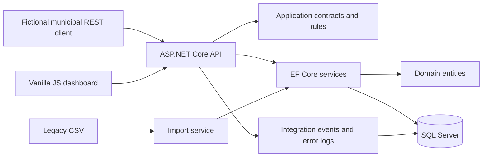

# Architecture

CivicPay simulates SaaS implementation work: configure a municipal client, migrate legacy accounts, accept synthetic integration records, reconcile imports and diagnose failures. It is a single deployable API, not a distributed payment processor.

## Dependencies

- Domain: plain C# entities with no web or EF dependency.
- Application: DTOs, service interfaces, pure validation rules and CSV parsing.
- Infrastructure: EF mapping, configuration/payment/import services, SQL Server migrations and synthetic seeding.
- API: controllers, HTTP mapping, authentication, correlation IDs, telemetry and static dashboard hosting.

Infrastructure implements application interfaces; API composes dependencies. This keeps pure rules testable without pretending every EF query needs a repository wrapper. Controllers project read entities into DTOs or explicit anonymous response shapes.

## Atomicity and concurrency

An accepted payment inserts the transaction and deducts the balance in one EF SaveChanges transaction. Account and configuration GUID versions are concurrency tokens. Payment acceptance advances both: account writes protect the balance, and configuration writes prevent a concurrent configuration change from invalidating a checked rule. This deliberately serializes payments per municipality; an implementation exercise favors clarity over maximum throughput. Account imports also advance the configuration token, preventing concurrent type removal from leaving newly imported accounts unpayable. Configuration GET versions therefore change after payments and new account imports.

A unique index on `(MunicipalityId, ExternalReference)` provides database-level duplicate protection. The exact normalized payload is compared to an existing transaction before current balance/configuration checks, allowing an identical retry after the balance changes. Different payloads return 409. Balance/rule validation failures recheck the reference to cover an original request committed between reads. Unique-key and optimistic-concurrency collisions re-read and retry up to three attempts; unrelated database failures propagate to the safe 500 handler. The composite account foreign key additionally prevents cross-municipality or wrong-type transaction relationships.

Imports parse the whole bounded file first (2 MB, 5000 rows); malformed CSV syntax or headers reject the file before creating a batch. Business validation errors are persisted per row. Each row uses a database transaction around payment/account changes and its ImportRecord. Previous successful rows remain committed if a later infrastructure failure ends the batch. A persisted expected record count reveals incomplete reporting. A hard process termination can leave a Processing batch; there is no background recovery worker.

## Observability

Every HTTP response has a generated X-Correlation-ID. Business requests persist status, timing and optional municipal context to IntegrationEvents. Errors persist a safe message in ErrorLogs. Body content, API keys and connection strings are not deliberately logged. ASP.NET/EF internal server diagnostics may include exception details; restrict access to these logs. Failure to write telemetry is logged and does not change a completed business response. Metrics are consequently best effort, not an accounting ledger.

Monitoring and health calls are excluded from request metrics. Synthetic seed transactions/error examples remain visibly labelled; they do not fabricate request counts or latency. Historic synthetic-* integration events from earlier demo databases are excluded from request analytics. Middleware duration covers endpoint execution, not telemetry persistence. Read-only business endpoints are included. Failed payment requests are events, not rejected PaymentTransaction rows. Identical API retries count as requests but not new accepted transactions.

## Development provider and limits

SQL Server is the deployment database and owns the generated migrations. SQLite is an explicit local/testing alternative initialized with EnsureCreated, not SQL Server migrations. It validates relational behavior but cannot prove SQL Server collation, locking, decimal precision or deployment behavior. Delete only the local synthetic SQLite database after a model change; never apply EnsureCreated to SQL Server.

Monitoring applies municipality, UTC date and applicable outcome filters in the database, then materializes matching datasets in memory for UTC grouping and decimal aggregation across both providers. It is intended for hundreds/thousands of portfolio records; a production implementation would push aggregation/pagination to SQL, add retention, stronger identity/roles, rate limits and operational recovery. The dashboard exposes latest 200 accepted transactions, 100 errors, 30 outcome-matching batches and 200 inspected rows. Full import-row and account pagination is available through APIs.

## Security boundary

All data is fictional. APIs require a random X-Api-Key by default. Open access must be explicitly enabled in Development/Testing. Compose binds API and database ports to loopback, runs API as a non-root user and obtains credentials from ignored .env. Its SA login and trusted local certificate are demo conveniences, not a deployment security model. No banking, card data, settlement or PCI claim exists.

Reference data is initialized independently of demo seed data: SQL Server receives the catalogue through the forward migration; SQLite initialization installs it explicitly. Disabling Database:Seed leaves no synthetic municipalities/accounts. SQL Server migrations are forward changes; the initial schema is preserved. Downgrading reference collation requires checking for case-only duplicate keys first.

SQL Server connections must leave MultipleActiveResultSets disabled; startup rejects MARS because it prevents EF savepoints, which import row recovery relies on. See [EF transaction/savepoint documentation](https://learn.microsoft.com/en-us/ef/core/saving/transactions). SQLite API connections always enable foreign-key enforcement.
