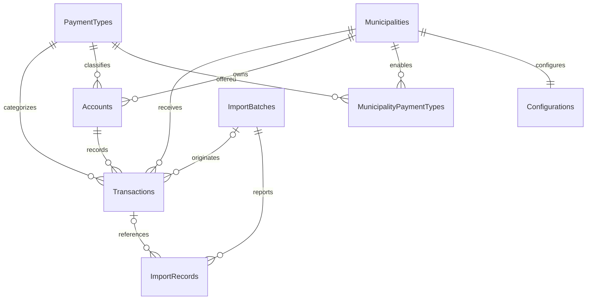

# Data dictionary

SQL Server mappings are in Infrastructure/CivicPayDbContext.cs and the generated sql/schema.sql. Amounts use decimal, never float. Timestamps use datetimeoffset; transaction effective date uses date. GUIDs use uniqueidentifier; IDs use int/bigint identity as appropriate.

| Table | Primary key | Main columns / relationships |
|---|---|---|
| Municipalities | Id int | Code nvarchar(40) unique, Name nvarchar(120), CreatedAt |
| Configurations | MunicipalityId int | One-to-one FK, Currency nvarchar(3), AllowPartialPayments bit, MinimumPayment decimal(12,2), Version GUID, UpdatedAt |
| PaymentTypes | Id int | Code nvarchar(30) unique catalogue |
| MunicipalityPaymentTypes | MunicipalityId + PaymentTypeId | Junction FKs defining enabled services |
| Accounts | Id int | MunicipalityId FK, AccountNumber nvarchar(60), PaymentTypeId FK, Balance decimal(12,2), Version GUID, CreatedAt |
| Transactions | Id GUID | MunicipalityId/AccountId/PaymentTypeId FKs, Amount decimal(12,2), TransactionDate date, ExternalReference nvarchar(100), Status nvarchar(20), optional ImportBatchId FK, CreatedAt |
| ImportBatches | Id GUID | Kind nvarchar(20), FileName nvarchar(120), ExpectedRecordCount int, Status nvarchar(20), CreatedAt, optional CompletedAt |
| ImportRecords | Id bigint | ImportBatchId FK, RowNumber int, MunicipalityCode nvarchar(40), optional SourceAmount decimal(14,2), ImportedAmount decimal(14,2), Status, ErrorCode, Message, optional TransactionId FK |
| IntegrationEvents | Id bigint | CorrelationId nvarchar(80), Path nvarchar(200), Method nvarchar(10), optional MunicipalityCode nvarchar(40), StatusCode int, DurationMs float, optional ErrorCode, CreatedAt |
| ErrorLogs | Id bigint | CorrelationId nvarchar(80), optional MunicipalityCode nvarchar(40), ErrorCode nvarchar(60), Message nvarchar(400), CreatedAt |

ImportRecord status: Imported, Rejected, Skipped. Batch status: Processing, Completed, Failed. Transaction status: Accepted (no synthetic rejected transaction is inserted). Telemetry codes contain validation or infrastructure errors, without request bodies.

## Constraints and indexes

- Municipality Code and PaymentType Code unique indexes.
- Account unique index `(MunicipalityId, AccountNumber)`.
- Transaction unique index `(MunicipalityId, ExternalReference)` prevents accidental retries.
- Composite account alternate key `(Id, MunicipalityId, PaymentTypeId)` supports a composite transaction FK, preserving tenant/type relationships.
- Check constraints enforce MinimumPayment>0, Balance>=0, Amount>0.
- Transaction `(MunicipalityId, TransactionDate)` index supports municipal/date reporting.
- ImportRecord `(ImportBatchId, RowNumber)` unique index prevents duplicate row reports.
- Event `(MunicipalityCode, CreatedAt)` and ErrorLog CreatedAt indexes support incident lookup/reporting.
- EF indexes ordinary foreign keys; deletes of accounts/municipalities/payment types used by records are restricted. Batch → ImportRecord cascade supports relational ownership; no delete API exists.

Source rows intentionally retain invalid municipality codes as text rather than forcing an FK, so unknown-client failures remain inspectable. Integration/error municipal context is also optional text: authentication and malformed JSON may fail before any municipality is parsed. No account holder names, bank details, card numbers or customer information exists.

GUID Version is application-managed optimistic concurrency, not SQL rowversion. Comparing old Version in EF update WHERE prevents lost balance/configuration updates. Monetary precision is additionally checked in application rules because SQLite does not enforce SQL Server decimal precision.

